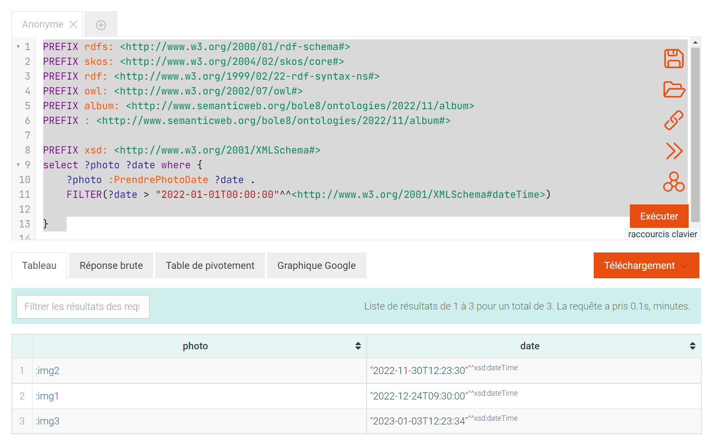

# liste de requêtes SPARQL

#### Toutes les photos de Bob
```
PREFIX rdfs: <http://www.w3.org/2000/01/rdf-schema#>
PREFIX skos: <http://www.w3.org/2004/02/skos/core#>
PREFIX rdf: <http://www.w3.org/1999/02/22-rdf-syntax-ns#>
PREFIX owl: <http://www.w3.org/2002/07/owl#>
PREFIX album: <http://www.semanticweb.org/bole8/ontologies/2022/11/album>
PREFIX : <http://www.semanticweb.org/bole8/ontologies/2022/11/album#>

select ?photo where { 
	?photo :AuteurPhoto "Bob"
} 
```
#### Résultat


####  Qui est sur la photo img4 ?
```
PREFIX rdfs: <http://www.w3.org/2000/01/rdf-schema#>
PREFIX skos: <http://www.w3.org/2004/02/skos/core#>
PREFIX rdf: <http://www.w3.org/1999/02/22-rdf-syntax-ns#>
PREFIX owl: <http://www.w3.org/2002/07/owl#>
PREFIX album: <http://www.semanticweb.org/bole8/ontologies/2022/11/album>
PREFIX : <http://www.semanticweb.org/bole8/ontologies/2022/11/album#>

select ?personne where { 
	:img4 :PersonneDansPhoto ?personne
} 
```
#### Résultat


####  Quand la photo img2 a-t-elle été prise  ?
```
PREFIX rdfs: <http://www.w3.org/2000/01/rdf-schema#>
PREFIX skos: <http://www.w3.org/2004/02/skos/core#>
PREFIX rdf: <http://www.w3.org/1999/02/22-rdf-syntax-ns#>
PREFIX owl: <http://www.w3.org/2002/07/owl#>
PREFIX album: <http://www.semanticweb.org/bole8/ontologies/2022/11/album>
PREFIX : <http://www.semanticweb.org/bole8/ontologies/2022/11/album#>

select ?date where { 
	:img2 :PrendrePhotoDate ?date
} 
```
#### Résultat


####  Où la photo img1 a-t-elle été prise  ?
```
PREFIX rdfs: <http://www.w3.org/2000/01/rdf-schema#>
PREFIX skos: <http://www.w3.org/2004/02/skos/core#>
PREFIX rdf: <http://www.w3.org/1999/02/22-rdf-syntax-ns#>
PREFIX owl: <http://www.w3.org/2002/07/owl#>
PREFIX album: <http://www.semanticweb.org/bole8/ontologies/2022/11/album>
PREFIX : <http://www.semanticweb.org/bole8/ontologies/2022/11/album#>

select ?lieu where { 
	:img1 :PrendrePhotoLieu ?lieu
}  
```
#### Résultat


####  Qu'y a-t-il sur la photo img4 ?  
```
PREFIX rdfs: <http://www.w3.org/2000/01/rdf-schema#>
PREFIX skos: <http://www.w3.org/2004/02/skos/core#>
PREFIX rdf: <http://www.w3.org/1999/02/22-rdf-syntax-ns#>
PREFIX owl: <http://www.w3.org/2002/07/owl#>
PREFIX album: <http://www.semanticweb.org/bole8/ontologies/2022/11/album>
PREFIX : <http://www.semanticweb.org/bole8/ontologies/2022/11/album#>

select ?obj where { 
	:img4 :ObjetPhoto ?obj
}
```
#### Résultat


####  type de la photo img3 ?  
```
PREFIX rdfs: <http://www.w3.org/2000/01/rdf-schema#>
PREFIX skos: <http://www.w3.org/2004/02/skos/core#>
PREFIX rdf: <http://www.w3.org/1999/02/22-rdf-syntax-ns#>
PREFIX owl: <http://www.w3.org/2002/07/owl#>
PREFIX album: <http://www.semanticweb.org/bole8/ontologies/2022/11/album>
PREFIX : <http://www.semanticweb.org/bole8/ontologies/2022/11/album#>

select ?type where { 
	:img3 :TypePhoto ?type
}   
```
#### Résultat


####  tous les types des photos   ?
```
PREFIX rdfs: <http://www.w3.org/2000/01/rdf-schema#>
PREFIX skos: <http://www.w3.org/2004/02/skos/core#>
PREFIX rdf: <http://www.w3.org/1999/02/22-rdf-syntax-ns#>
PREFIX owl: <http://www.w3.org/2002/07/owl#>
PREFIX album: <http://www.semanticweb.org/bole8/ontologies/2022/11/album>
PREFIX : <http://www.semanticweb.org/bole8/ontologies/2022/11/album#>

select ?photo ?type where { 
	?photo :TypePhoto ?type
}   
```
#### Résultat


####  tous les types (type == vie ) des photos   ?
```
PREFIX rdfs: <http://www.w3.org/2000/01/rdf-schema#>
PREFIX skos: <http://www.w3.org/2004/02/skos/core#>
PREFIX rdf: <http://www.w3.org/1999/02/22-rdf-syntax-ns#>
PREFIX owl: <http://www.w3.org/2002/07/owl#>
PREFIX album: <http://www.semanticweb.org/bole8/ontologies/2022/11/album>
PREFIX : <http://www.semanticweb.org/bole8/ontologies/2022/11/album#>

select ?photo where { 
	?photo :TypePhoto "vie"
}    
```
#### Résultat


####  tous les dates des photos  ?
```
PREFIX rdfs: <http://www.w3.org/2000/01/rdf-schema#>
PREFIX skos: <http://www.w3.org/2004/02/skos/core#>
PREFIX rdf: <http://www.w3.org/1999/02/22-rdf-syntax-ns#>
PREFIX owl: <http://www.w3.org/2002/07/owl#>
PREFIX album: <http://www.semanticweb.org/bole8/ontologies/2022/11/album>
PREFIX : <http://www.semanticweb.org/bole8/ontologies/2022/11/album#>

select ?photo ?date where { 
	?photo :PrendrePhotoDate ?date
}     
```
#### Résultat


####  tous les dates des photos ( après que 2022-01-01 )   ?
```
PREFIX rdfs: <http://www.w3.org/2000/01/rdf-schema#>
PREFIX skos: <http://www.w3.org/2004/02/skos/core#>
PREFIX rdf: <http://www.w3.org/1999/02/22-rdf-syntax-ns#>
PREFIX owl: <http://www.w3.org/2002/07/owl#>
PREFIX album: <http://www.semanticweb.org/bole8/ontologies/2022/11/album>
PREFIX : <http://www.semanticweb.org/bole8/ontologies/2022/11/album#>

PREFIX xsd: <http://www.w3.org/2001/XMLSchema#>
select ?photo ?date where { 
	?photo :PrendrePhotoDate ?date .
    FILTER(?date > "2022-01-01T00:00:00"^^<http://www.w3.org/2001/XMLSchema#dateTime>)
    
}       
```
#### Résultat



####  tous les objets sont mer sur des photos  ?
```
PREFIX rdfs: <http://www.w3.org/2000/01/rdf-schema#>
PREFIX skos: <http://www.w3.org/2004/02/skos/core#>
PREFIX rdf: <http://www.w3.org/1999/02/22-rdf-syntax-ns#>
PREFIX owl: <http://www.w3.org/2002/07/owl#>
PREFIX album: <http://www.semanticweb.org/bole8/ontologies/2022/11/album>
PREFIX : <http://www.semanticweb.org/bole8/ontologies/2022/11/album#>

PREFIX xsd: <http://www.w3.org/2001/XMLSchema#>
select ?photo ?date where { 
	?photo :ObjetPhoto "mer" .
}       
```
#### Résultat


####  tous les lieus sont France sur des photos  ?
```
PREFIX rdfs: <http://www.w3.org/2000/01/rdf-schema#>
PREFIX skos: <http://www.w3.org/2004/02/skos/core#>
PREFIX rdf: <http://www.w3.org/1999/02/22-rdf-syntax-ns#>
PREFIX owl: <http://www.w3.org/2002/07/owl#>
PREFIX album: <http://www.semanticweb.org/bole8/ontologies/2022/11/album>
PREFIX : <http://www.semanticweb.org/bole8/ontologies/2022/11/album#>

PREFIX xsd: <http://www.w3.org/2001/XMLSchema#>
select ?photo ?date where { 
	?photo :PrendrePhotoLieu "France" .
}       
```
#### Résultat


####  tous les types sont vie et Auther est Bob sur des photos  ?
```
PREFIX rdfs: <http://www.w3.org/2000/01/rdf-schema#>
PREFIX skos: <http://www.w3.org/2004/02/skos/core#>
PREFIX rdf: <http://www.w3.org/1999/02/22-rdf-syntax-ns#>
PREFIX owl: <http://www.w3.org/2002/07/owl#>
PREFIX album: <http://www.semanticweb.org/bole8/ontologies/2022/11/album>
PREFIX : <http://www.semanticweb.org/bole8/ontologies/2022/11/album#>

PREFIX xsd: <http://www.w3.org/2001/XMLSchema#>
select ?photo ?type where { 
	?photo :TypePhoto "vie" .
    ?photo :AuteurPhoto "Bob"
}      
```
#### Résultat


####  tous les types sont Vacance et (option)Auther est Bob sur des photos  ?
```
PREFIX rdfs: <http://www.w3.org/2000/01/rdf-schema#>
PREFIX skos: <http://www.w3.org/2004/02/skos/core#>
PREFIX rdf: <http://www.w3.org/1999/02/22-rdf-syntax-ns#>
PREFIX owl: <http://www.w3.org/2002/07/owl#>
PREFIX album: <http://www.semanticweb.org/bole8/ontologies/2022/11/album>
PREFIX : <http://www.semanticweb.org/bole8/ontologies/2022/11/album#>

PREFIX xsd: <http://www.w3.org/2001/XMLSchema#>
select ?photo ?type where { 
	?photo :TypePhoto "Vacance" .
    OPTIONAL {?photo :AuteurPhoto "Bob"}
}      
```
#### Résultat


####  tous les types sont Vacance et vie sur des photos  ?
```
PREFIX rdfs: <http://www.w3.org/2000/01/rdf-schema#>
PREFIX skos: <http://www.w3.org/2004/02/skos/core#>
PREFIX rdf: <http://www.w3.org/1999/02/22-rdf-syntax-ns#>
PREFIX owl: <http://www.w3.org/2002/07/owl#>
PREFIX album: <http://www.semanticweb.org/bole8/ontologies/2022/11/album>
PREFIX : <http://www.semanticweb.org/bole8/ontologies/2022/11/album#>

PREFIX xsd: <http://www.w3.org/2001/XMLSchema#>
select ?photo where {
    {?photo :TypePhoto "Vacance"}UNION{?photo :TypePhoto "vie"}
}       
```
#### Résultat


####  tous les photos order par la date  ?
```
PREFIX rdfs: <http://www.w3.org/2000/01/rdf-schema#>
PREFIX skos: <http://www.w3.org/2004/02/skos/core#>
PREFIX rdf: <http://www.w3.org/1999/02/22-rdf-syntax-ns#>
PREFIX owl: <http://www.w3.org/2002/07/owl#>
PREFIX album: <http://www.semanticweb.org/bole8/ontologies/2022/11/album>
PREFIX : <http://www.semanticweb.org/bole8/ontologies/2022/11/album#>

PREFIX xsd: <http://www.w3.org/2001/XMLSchema#>
select ?photo ?date where { 
	?photo :PrendrePhotoDate ?date
}   
ORDER BY DESC(?date)      
```
#### Résultat


 
